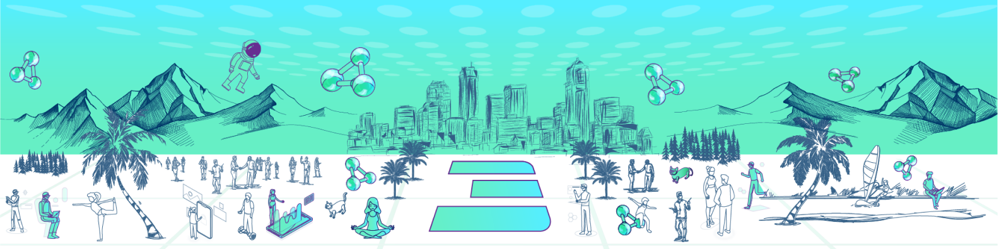

# Welcome to the ThreeFold Foundation

ThreeFold is the engine for a planet positive and data sovereign Internet. A collaborative movement of people who care about a better future.

We believe that content is like a product and as such we have chosen to use Github to work on all our content.
Nearly all our repos are public and opensource and you can contribute and leave issues so that we can constantly improve.

 

## Releases following ThreeFold Grid development

- [2.5.2](https://github.com/orgs/threefoldfoundation/projects/48): - 27 February
- [2.5.3](https://github.com/orgs/threefoldfoundation/projects/51): - 6 March
- [2.6](https://github.com/orgs/threefoldfoundation/projects/58) : - 13 March
- [2.6.1](https://github.com/orgs/threefoldfoundation/projects/59) : - 21 March
- [2.7](https://github.com/orgs/threefoldfoundation/projects/60) : - 28 March
- [2.7.1](https://github.com/orgs/threefoldfoundation/projects/61) : - 4 April
- [2.8](https://github.com/orgs/threefoldfoundation/projects/62) : - 11 April
- [2.8.1](https://github.com/orgs/threefoldfoundation/projects/63) : - 18 April

 

We've moved to weekly sprints per circles (aka teams), you can follow each team's tasks and progress [HERE](https://github.com/orgs/threefoldfoundation/projects)

 

## Teams

- Web development : [team](https://github.com/orgs/threefoldfoundation/teams/web_team) | [team board](https://github.com/orgs/threefoldfoundation/projects/54)
- Promotion: [team](https://github.com/orgs/threefoldfoundation/teams/team_promotion) | [team board](https://github.com/orgs/threefoldfoundation/projects/52)
- Technical Documentation: [team](https://github.com/orgs/threefoldfoundation/teams/tech_documentation) | [team board](https://github.com/orgs/threefoldfoundation/projects/57)

 

## ThreeFold Foundation's main project repos

Feel free to visit project repos and/or reach out to respective team should you have any questions or wish to contribute.

|Project |Type |Repo |Team | DNS |
|--- |--- |--- |--- |--- |
| ThreeFold main | website | [www_threefold_io](https://github.com/threefoldfoundation/www_threefold_io) | [team_promotion](https://github.com/orgs/threefoldfoundation/projects/52) / [team_web](https://github.com/orgs/threefoldfoundation/projects/54) | [threefold.io](https://threefold.io/) |
| ThreeFold main | wiki | [info_foundation](https://github.com/threefoldfoundation/info_foundation) | [team_promotion](https://github.com/orgs/threefoldfoundation/projects/52) | [threefold.io/info/threefold](https://threefold.io/info/threefold) |
| ThreeFold Grid Manual | wiki | [info_sdk](https://github.com/threefoldfoundation/info_sdk) | [team_tech_documentation](https://github.com/orgs/threefoldfoundation/projects/57) | [threefold.io/info/sdk](https://threefold.io/info/sdk#/)
| ThreeFold Marketplace | website | [www_threefold_marketplace](https://github.com/threefoldfoundation/www_threefold_marketplace) | [team_promotion](https://github.com/orgs/threefoldfoundation/projects/52) / [team_web](https://github.com/orgs/threefoldfoundation/projects/54) | [threefold.io/marketplace](https://threefold.io/marketplace) |
| ThreeFold Farming | website | [www_threefold_farming](https://github.com/threefoldfoundation/www_threefold_farming) | [team_promotion](https://github.com/orgs/threefoldfoundation/projects/52) / [team_web](https://github.com/orgs/threefoldfoundation/projects/54) | [threefold.io/farming](https://threefold.io/farming) |
| ThreeFold Cloud | website | [www_threefold_cloud](https://github.com/threefoldfoundation/www_threefold_cloud) | [team_promotion](https://github.com/orgs/threefoldfoundation/projects/52) / [team_web](https://github.com/orgs/threefoldfoundation/projects/54) | [threefold.io/cloud](https://threefold.io/cloud) |
| ThreeFold Cloud | wiki | [info_cloud](https://github.com/threefoldfoundation/info_cloud) | [team_tech_documentation](https://github.com/orgs/threefoldfoundation/projects/57) | [threefold.io/info/cloud](https://threefold.io/info/cloud) |
| ThreeFold Legal | wiki | [info_legal](https://github.com/threefoldfoundation/info_legal) | [team_promotion](https://github.com/orgs/threefoldfoundation/projects/52) | [threefold.io/info/legal](https://threefold.io/info/legal) |
| ThreeFold Data | data | [threefold_data](https://github.com/threefoldfoundation/threefold_data) | [team_web](https://github.com/orgs/threefoldfoundation/projects/54) | - | 
| Examplesite | data | [www_examplesite](https://github.com/threefoldfoundation/www_examplesite) | [team_web](https://github.com/orgs/threefoldfoundation/projects/54) | [examplesite.threefold.io](https://examplesite.threefold.io/) |

## Related Projects

|Property |Type |Repo |Team | DNS |
|--- |--- |--- |--- |--- |
| DigitalTwin | website | [www_threefold_twin](https://github.com/threefoldfoundation/www_threefold_twin) | [team_digitaltwin](https://github.com/orgs/threefoldfoundation/projects/53) | [mydigitaltwin.io](https://mydigitaltwin.io) |
| DigitalTwin | wiki | [info_digitaltwin](https://github.com/threefoldfoundation/info_digitaltwin) | [team_digitaltwin](https://github.com/orgs/threefoldfoundation/projects/53) | [info.mydigitaltwin.io](https://info.mydigitaltwin.io) |
| ThreeFold Tech | website | [www_threefold_tech](https://github.com/threefoldtech/www_threefold_tech) | [front_end](https://github.com/orgs/threefoldtech/teams/front-end) | [threefold.tech](https://threefold.tech) |
| ThreeFold Tech | wiki | [info_tftech](https://github.com/threefoldtech/info_tftech) | [documentation](https://github.com/orgs/threefoldtech/teams/documentation) | [info.threefold.tech](https://info.threefold.tech/) |
| ThreeFold Explorer | website | [nodes-explorer](https://github.com/threefoldtech/nodes-explorer) | Owner: [@dylanverstraete](https://github.com/DylanVerstraete) | [explorer.threefold.io](https://explorer.threefold.io) |
| Alliance for Conscious Internet | website | [www_conscious_internet](https://github.com/threefoldfoundation/www_conscious_internet) | [team_web](https://github.com/orgs/threefoldfoundation/projects/54) | [www.consciousinternet.org](https://www.consciousinternet.org) |
| Mazraa | website | [www_mazraa_io](https://github.com/mazraa/www_mazraa_io) | [team_promotion](https://github.com/orgs/threefoldfoundation/projects/52) | [www.mazraa.io](https://www.mazraa.io) |
| BetterToken | website | [www_bettertoken.com](https://github.com/BetterToken/www_bettertoken.com) | [VonSub](https://github.com/VonSub) | [bettertoken.com](https://bettertoken.com) |
| BetterToken | wiki | [info_bettertoken](https://github.com/BetterToken/info_bettertoken) | [VonSub](https://github.com/VonSub) | [wiki.bettertoken.com](https://wiki.bettertoken.com/) |

 

## Collaboration

Find our collaboration guidelines [HERE](https://github.com/threefoldfoundation/info_sdk/blob/development/src/collab.md).

If you'd like to collaborate on our web presence (wikis and/or websites) please locate the respective website's or wiki's repo and create an issue. The team will make sure it's addressed.

We appreciate your involvement and support!

 

## Disclaimer

- All code, information, tools & knowledge found in [TF Foundation's github account](github.com/threefoldfoundation) or otherwise produced by ThreeFold Foundation or any person or party related to it is delivered "as is", see [Disclaimer](https://github.com/threefoldfoundation/legal/blob/master/src/disclaimer.md)
- Everyone is welcome to contribute, whatever you contribute will follow the licenses as mentioned in relevant repository
- See our definitions, terms and conditions, disclaimer in [TF Legal](https://github.com/threefoldfoundation/legal/tree/master/src)

