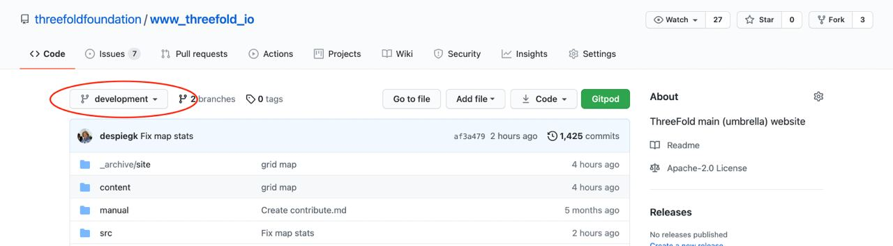

# Get started with Gitpod

To easily collaborate on ThreeFold's websites and wikis use **[Gitpod](https://www.gitpod.io).

## Here is How

1. Go through provided team link to add yourself to the team:
https://gitpod.io/plans?teamid=e38e1c1a-4204-4549-bd78-22c97acfc277

2. Add Gitpod extension to Chrome, or Firefox (won’t work with Safari)
https://www.gitpod.io/docs/browser-extension/

3. Go to any ThreeFold's website or wiki repo. Make sure you are on **development** branch (always)!!

4. You should see a green Gitpod button on the top right. Click on it!

5. You now see a dashboard that looks just like VSCode because it is. You can make changes from there the same way you've work on VSCode tool before (if you have).

6. Cool part - you can now right away see the changes you made (without pushing them) in your browser by **Cmnd + Click** (Mac) on url that has been automatically generated in terminal on the bottom of the dashboard.

7. Now Go explore & contribute! 🙂
