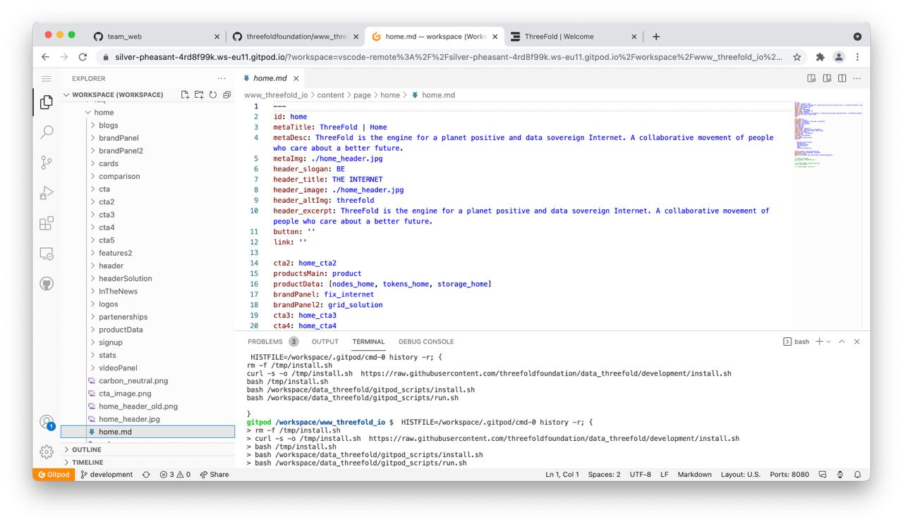
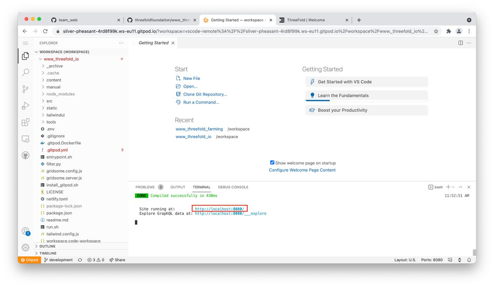

# Get started with Gitpod

To easily collaborate on ThreeFold's websites and wikis use **[Gitpod](https://www.gitpod.io)**.

## Here is How

1. Add yourself to the team through **[HERE](https://gitpod.io/plans?teamid=e38e1c1a-4204-4549-bd78-22c97acfc277)**.

 

2. **[Add Gitpod](https://www.gitpod.io/docs/browser-extension/)** extension to Chrome, or Firefox (won’t work with Safari).

 

3. Go to any ThreeFold's website or wiki repo. Make sure you create a branch that describes your contribution and select it before you start working!!

 

 

4. After selecting the right branch locate a green Gitpod button on the top right. Click on it!

 

 

5. You now see a dashboard that looks just like VSCode because it is. You can make changes from there the same way you've work on VSCode tool before (if you have).

 

 

6. Cool part - you can now right away see the changes you made (without pushing them) in your browser by **Cmnd + Click** (Mac) on url that has been automatically generated in terminal on the bottom of the dashboard.

 

 

7. When done push your changes and create Pull Request into Development. One of web team members will review and merge it! 🙂
